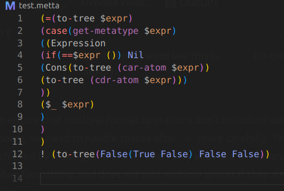
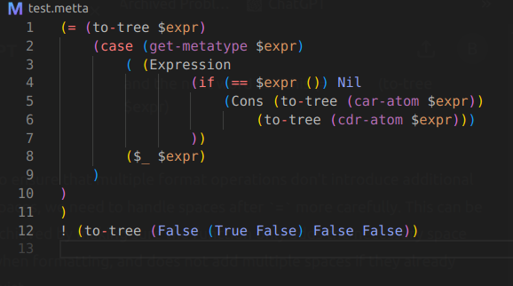
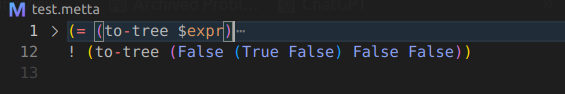
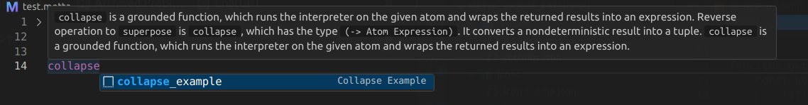

# MeTTa Language Support

This extension provides Syntax Auto-Formatting, Highlighting, Linting, Hovering for detail, Code Snippets, Folding and File-Icon for the MeTTa programming language.

## Instructions

- Install the extension 
- If your code base is only in MeTTa, Set Color Theme provided by the extension
- To change between themes press: `CTR + SHIFT + P`, search for color theme and click, then choose Dark Modern or Metta Theme.
- I don't recommend setting file icon theme provided by this extension since it currently doesn't support other file types other than MeTTa.

## Features

- Document Auto-formatting for MeTTa files by pressing CTR + SHIFT + P Then Choosing MeTTa: Enable Formatter
- Syntax highlighting for MeTTA language
- Hovering for more detail on keys
- Linting for Error handling
- Snippets to give you starter
- Folding to make you code cleaner
- Custom file icon for `.metta` files (I only added 1 icon for MeTTa. I will add others later if necessary)
- Simple Refactor with ctr + shift + R
- More Features will be added. You can also contribute for more features.

## Some Screenshots

<table>
    <tr>
        <td>
            <h3 style="text-align: center;">Before Formatting</h3>
            
        </td>
        <td>
            <h3 style="text-align: center;">After Formatting</h3>
            
        </td>
    </tr>
    <tr>
        <td>
            <h3 style="text-align: center;">Folding</h3>
            
        </td>
        <td>
            <h3 style="text-align: center;">Hover and Snippets</h3>
            
        </td>
    </tr>
</table>

## Installation to Test the extension locally

1. Clone this repository.
2. Run `npm install` to install dependencies.
3. Open the repository in VS Code.
4. Press `F5` to open a new VS Code window with the extension loaded.

## Usage

- Open a `.metta` file to see the syntax highlighting and file icon.
- Press `Ctrl+Shift+P the choose MeTTa: Enable Formatter` to format the document.
- `CTR + SHIFT + P` then choose Metta Theme for Highlighting Perfectly (Note: It doesn't support other languages so you have to shift to Dark Modern theme for other language.)
- Hover over the Keywords to read the detail on it
- Go over the Number column to see the Folding arrow.

## Contributing

Feel free to submit issues and pull requests for new features and improvements.

